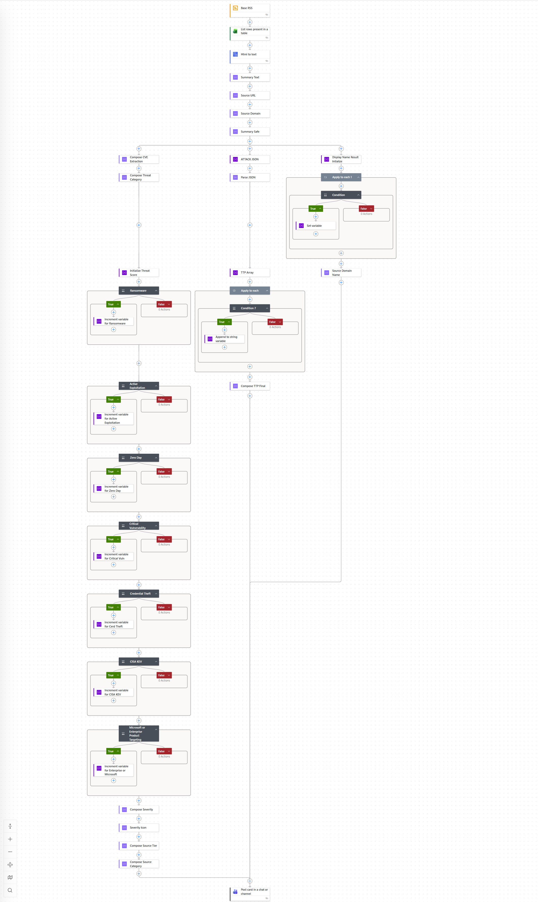

# Threat Intelligence & OSINT Automation Pipeline

> **Status:** Production Deployed | Live SOC Environment
> **Stack:** Microsoft Power Automate · Microsoft Teams · Excel · M365 Ecosystem · RSS · JSON
> **Domain:** Threat Intelligence Engineering · SOC Automation · Detection Support

---

## Overview

This project is a production-deployed, automated threat intelligence ingestion and enrichment pipeline currently operating within a live Security Operations Center environment. It aggregates open-source intelligence from 46 curated RSS-based sources, applies a multi-category threat scoring engine, extracts structured threat metadata, and delivers analyst-ready intelligence cards directly into Microsoft Teams.

The goal was to eliminate manual OSINT collection workflows entirely and replace them with a structured, scored, and categorized intelligence feed that an analyst can consume at a glance without context-switching between browser tabs, subscription portals, or raw feed readers.

**Operational outcomes achieved:**
- 85% reduction in manual OSINT collection time per analyst shift
- 60% faster intelligence delivery compared to commercial subscription-based sources
- Structured, consistent intelligence format across 46 heterogeneous source types
- Automated ATT&CK technique extraction and CVE detection surfaced at point of delivery

*Note: All organizational identifiers, internal channel references, and source-specific configuration details have been sanitized in compliance with applicable regulatory and organizational requirements.*

---

## Architecture

The pipeline operates as a multi-branch automated workflow triggered on a per-feed basis. At a high level the flow moves through four functional stages:


*Power Automate flow canvas showing the multi-branch scoring engine, parallel enrichment pipelines, and adaptive card composition logic. Organizational identifiers sanitized.*


```
RSS Trigger
    │
    ▼
Data Extraction & Variable Initialization
    │
    ├──────────────────────┬──────────────────────┐
    ▼                      ▼                      ▼
CVE Extraction         ATT&CK JSON            Display Name
& Threat Category      Parsing &              Resolution
Composition            TTP Array Build
    │                      │                      │
    └──────────────────────┴──────────────────────┘
                           │
                           ▼
              Multi-Category Threat Scoring Engine
              (Sequential conditional branches)
                           │
                           ▼
              Severity Composition & Icon Assignment
                           │
                           ▼
              Source Tier & Category Classification
                           │
                           ▼
              Adaptive Card Composition & Teams Delivery
```

---

## Scoring Engine Design

The core of this pipeline is a multi-branch conditional scoring engine that evaluates each ingested intelligence item against seven threat category conditions. Each condition that evaluates true increments a cumulative threat score variable, which then drives the final severity rating assigned to the card.

**Scoring categories evaluated per item:**

| Category | Detection Logic |
|---|---|
| Ransomware | Keyword and behavioral indicator matching against article content |
| Active Exploitation | In-the-wild exploitation signal detection |
| Zero Day | Unpatched/unknown vulnerability indicator matching |
| Critical Vulnerability | Severity classification signal extraction |
| Credential Theft | Identity and authentication threat indicator matching |
| CISA KEV | Known Exploited Vulnerability catalog reference detection |
| Microsoft / Enterprise Product Targeting | Enterprise platform targeting signal matching |

Each category contributes independently to the cumulative score. Final severity is computed from the total score and rendered as a color-coded rating on the analyst-facing card.

---

## ATT&CK Technique Extraction

A parallel processing branch handles MITRE ATT&CK technique identification. Raw article content is passed through a JSON parsing workflow that iterates over a TTP array using apply-to-each logic, evaluating each item against known technique identifiers and appending matches to a string variable that surfaces on the output card.

When no techniques are identified the field renders explicitly as "No techniques identified" rather than displaying blank, preserving card structure consistency for analyst scanning.

---

## CVE Detection

A dedicated CVE extraction branch evaluates each item for CVE identifier references. Detected CVEs are surfaced in a dedicated card field. When no CVEs are present the field renders as "No CVE Detected" rather than null, again preserving structural consistency across all card outputs regardless of content type.

---

## Output Card Structure

Each intelligence item is delivered to the analyst channel as a structured adaptive card with the following fields:


*Sample analyst-facing adaptive card delivered to Microsoft Teams. Content shown is publicly available cybersecurity news used for illustration purposes.*


```
┌─────────────────────────────────────────────────┐
│  [Source Name] OSINT Update                     │
│                                                 │
│  [Article Title]                                │
│                                                 │
│  [Summary excerpt — truncated for readability]  │
│                                                 │
│  ┌──────────┬──────────────────┬─────────────┐  │
│  │ SEVERITY │ THREAT CATEGORY  │  TI SIGNAL  │  │
│  │  [level] │  [emoji + label] │   [level]   │  │
│  └──────────┴──────────────────┴─────────────┘  │
│                                                 │
│  SOURCE              PUBLISHED                  │
│  [domain]            [timestamp]                │
│                                                 │
│  SOURCE CATEGORY     CVES                       │
│  [category label]    [CVE IDs or "None"]        │
│                                                 │
│  ATT&CK TECHNIQUES                              │
│  [Technique list or "No techniques identified"] │
│                                                 │
│  [Read more →]                                  │
└─────────────────────────────────────────────────┘
```

**Design rationale:** Every field on this card was chosen to answer a specific analyst question without requiring them to click through to the source article. Severity and TI Signal answer "how urgent is this?" Threat Category answers "what kind of threat is this?" Source and Source Category answer "how much should I trust this signal?" CVEs and ATT&CK Techniques answer "is this relevant to our environment and detection coverage?" The Read More button exists only for analysts who need full context after making an initial triage decision from the card alone.

---

## Intelligence Sources

The pipeline aggregates from 46 curated RSS-based sources spanning the following categories:

- Government and regulatory advisories
- Vendor security research and disclosure blogs
- Threat intelligence aggregators
- Vulnerability databases and tracking sources
- Cybersecurity news and research publications

*Specific source URLs and organizational feed configurations are not published in compliance with operational security requirements.*

---

## Engineering Decisions & Iterations

**Why RSS over API integrations?**
RSS provides broad source coverage without per-source API key management, rate limit negotiation, or authentication overhead. For a 46-source pipeline the operational simplicity of RSS dramatically outweighed the marginal data richness of direct API integrations for most source types.

**Why Power Automate over a custom Python pipeline?**
The target deployment environment was M365-native. Power Automate allowed native integration with Teams, Excel, and organizational authentication without infrastructure overhead, firewall exceptions, or maintenance burden. For a SOC environment where operational continuity matters, a no-code/low-code platform with built-in monitoring and retry logic was the right architectural choice.

**Why sequential scoring branches rather than a single scoring model?**
Each threat category required independent conditional logic that could be maintained, modified, or extended by an analyst without programming knowledge. Sequential branches make the scoring logic auditable and transparent. A single scoring model would have been more opaque and harder to tune as threat priorities evolve.

**Challenges encountered:**
- ATT&CK technique extraction required iterative refinement of the TTP matching logic to reduce false positive technique attributions from articles that referenced techniques contextually rather than as active threat indicators
- Summary text required sanitization logic to handle RSS feeds that embed HTML markup in description fields, which rendered incorrectly in adaptive card text blocks
- Source categorization required manual classification of all 46 sources into consistent category labels to ensure the source tier field carried meaningful signal rather than just raw domain names

---

## Skills Demonstrated

`Power Automate` `Adaptive Card Design` `JSON Parsing` `Conditional Logic Engineering`
`MITRE ATT&CK` `Threat Intelligence Tradecraft` `RSS Integration` `M365 Ecosystem`
`SOC Workflow Design` `Analyst UX` `Security Automation` `CVE Analysis`

---

## Related Projects

- [KQL Detection Engineering Library](../KQL%20Queries/) — Behavioral detections informed by intelligence surfaced through this pipeline
- [SOC Defensive Security Project](../SOC%20Defensive%20Security%20Project/) — Broader SOC operational infrastructure this pipeline supports

---

*Production deployment. All content sanitized for public release in compliance with applicable organizational and regulatory requirements.*
